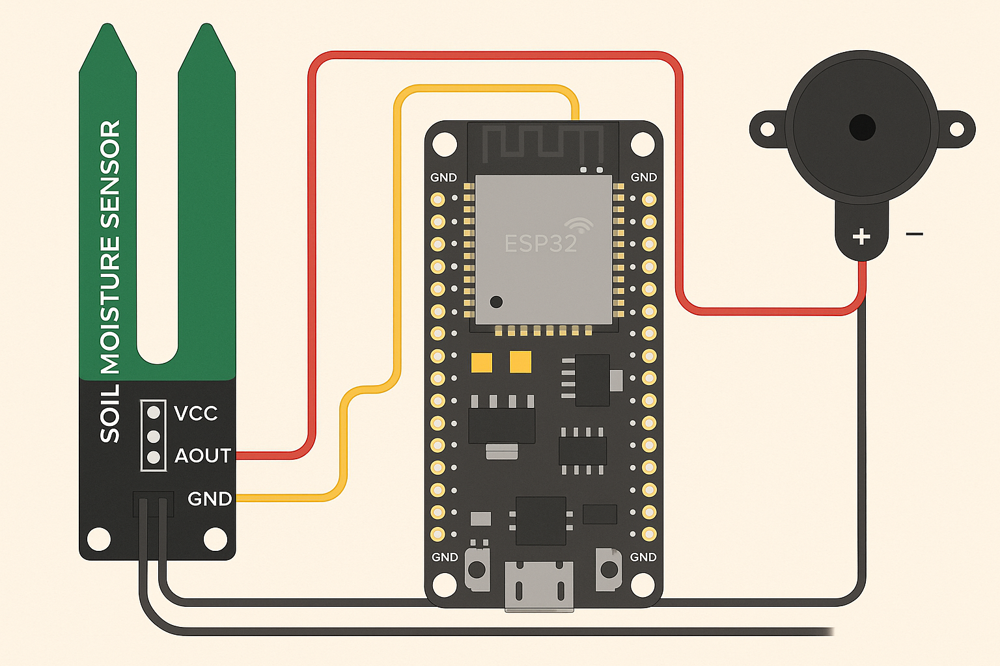

# 🌱 Tanaman Teriak – Proyek ESP32 + Sensor Kelembaban + Buzzer

Proyek ini menggunakan **ESP32**, **sensor kelembaban tanah**, dan **buzzer** untuk membuat tanaman "berteriak" saat tanahnya kering. Sistem ini memantau kelembaban tanah dan mengaktifkan buzzer ketika kadar air turun di bawah ambang batas tertentu.

---

## 🧠 Cara Kerja

- Sensor membaca nilai kelembaban tanah dari pin analog (`GPIO 34`)
- Jika tanah terlalu kering (nilai lebih besar dari 2000), buzzer menyala selama 3 detik
- Setelah itu buzzer mati dan sistem kembali memantau

---

## 🧰 Komponen yang Digunakan

| Komponen             | Keterangan                    |
|----------------------|-------------------------------|
| ESP32                | Board mikrokontroler utama    |
| Sensor kelembaban    | Bisa kapasitif atau YL-69     |
| Buzzer (aktif)       | Speaker kecil / modul buzzer  |
| Kabel Jumper         | Untuk koneksi antar komponen  |
| Breadboard (opsional)| Untuk merapikan rangkaian     |

---

## 🔌 Skema Koneksi

Pin Sensor | Pin ESP32
VCC | 3V3
GND | GND
AOUT / Analog Out | GPIO 34

Pin Buzzer | Pin ESP32
VCC / + | GPIO 15
GND / - | GND